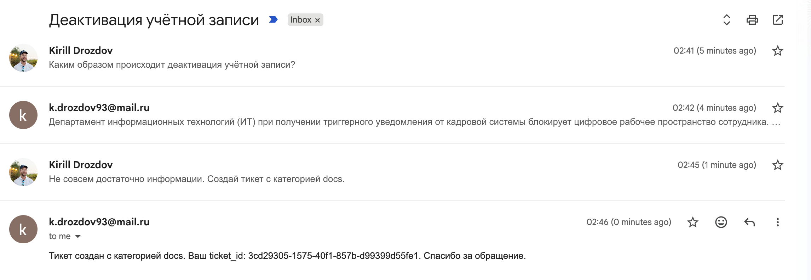
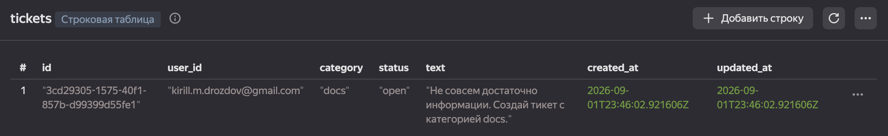
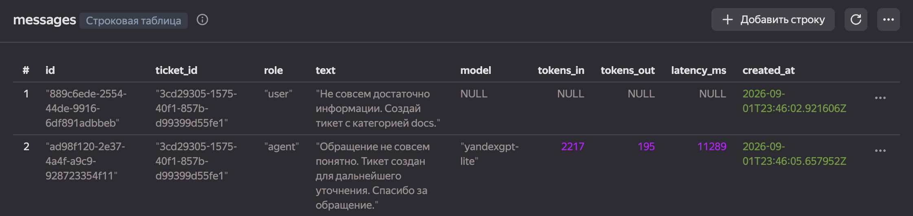
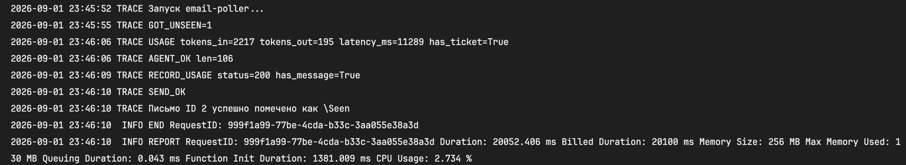
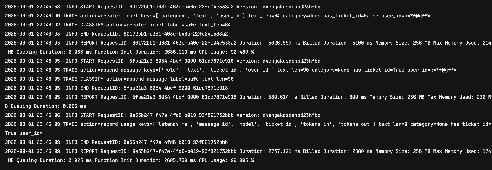

### Hexlet tests and linter status:
[](https://github.com/kmdrozdov/llm-developer-project-425/actions)

### Ключи в Lockbox

| secret_id | variable_name |
|--|--|
| ydb-endpoint | Эндпоинт для подключения к БД |
| ydb-database | Путь до БД |
| ai-studio-api-key | Ключ AI Studio |
| email-credentials | Ключ для работы IMAP/SMTP |

### Роли для Service Account

`functions.functionInvoker`, `lockbox.payloadViewer`, `ydb.editor`, `serverless.mcpGateways.invoker`, `ai.languageModels.user`

### Trusted content

- системный промпт / instructions / promptTemplateId;
- конфигурация MCP (server_url, схема tools, require_approval);
- vector_store_ids, модерация, URI модели.

### Untrusted content

- текст письма и From;
- фрагменты RAG (file_search), если документы когда-либо приходят извне;
- аргументы tool-call, которые модель собрала из письма (text, ticket_id).

### Дополнительная информация

- help desk ящик - k.drozdov93@mail.ru
- ссылка на репозиторий - https://github.com/kmdrozdov/llm-developer-project-425
- ссылка на агент - https://aistudio.yandex.ru/platform/folders/b1gtee7fdkfooguv6g8e/agents

### Демо

- общение с агентом по почте



- добавленный тикет



- добавленные сообщения



- трейс `email-poller`



- трейс `mcp`



### Что попробовать?

- ```В каких случаях инициализируется процесс увольнения?```
- ```Какие нужны документы при оформлении нового сотрудника?```
- ```Какой крайний срок для оформления заявки на оплату курсов на повышение квалификации?```